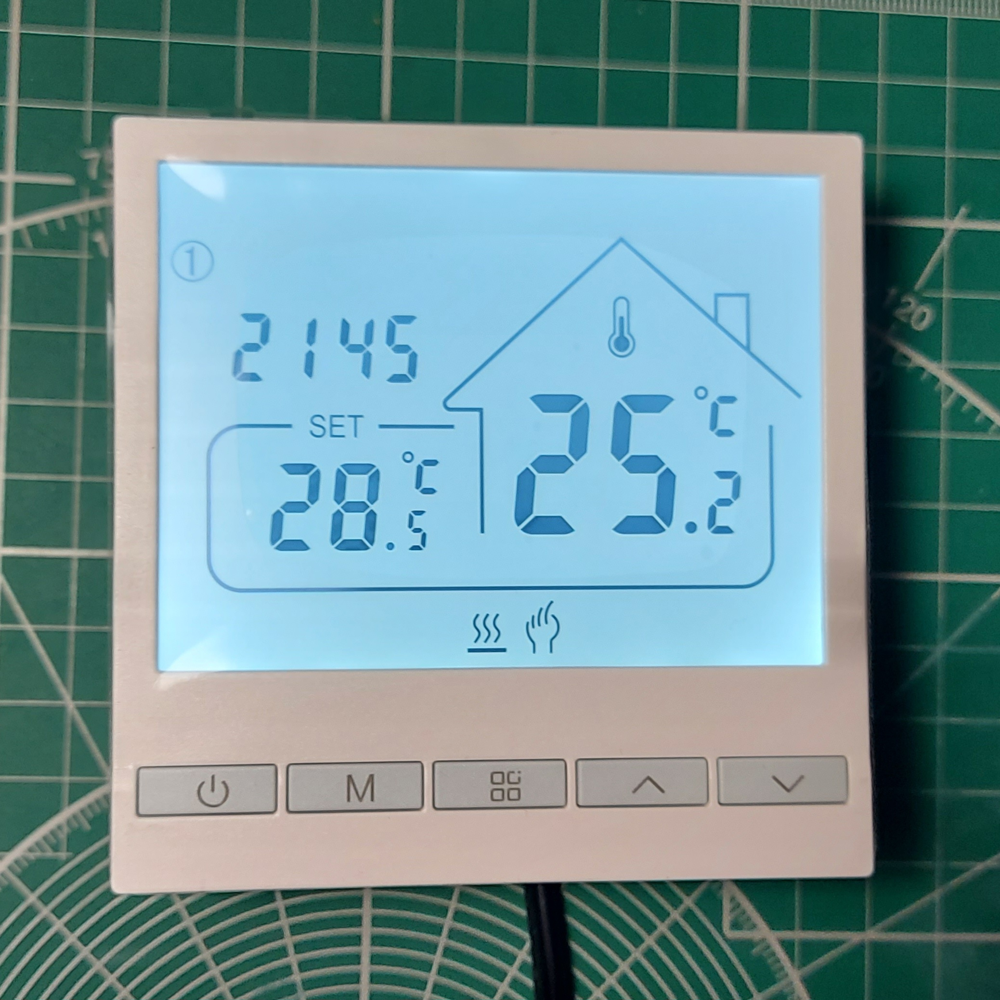
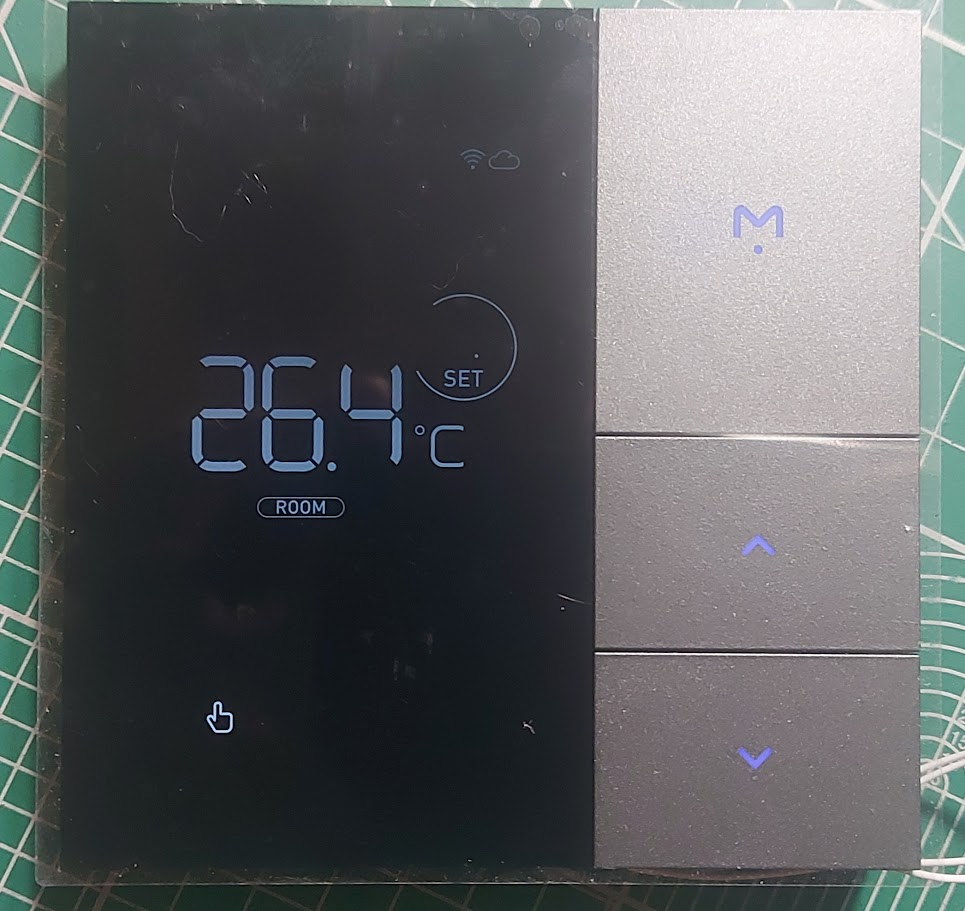

# tuya-device-analysis

Утилита для анализа и автоматического парсинга команд протоколо щения Wifi модулей Tuya. Для анализа необходимо подключить два COM порта присоединенных к линии Rx и Tx модуля (для чтения). Указать имена компортов и дивайс (из списка).

Пример команды
``` shell
tuya --rx="COM1" --tx="COM2" --device="Tol47WifiEp"
```

# Доступные устройства

## Tol47WifiEp


## TH1130



